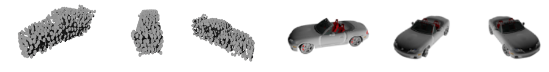

# RecMVCNN

RecMVCNN is a lightweight multi-view based approach for classification and reconstruction of a 3D structure. It takes rendered images of a 3D representation like a mesh, a point cloud, or a voxel grid as input and simultaneous classifies the content of those rendered images and reconstructs the 3D shape in the form of a voxel grid. The architecture of our approach is depicted below.

The big advantage of this approach is that we can leverage the expressiveness of pre-trained convolutional backbones to extract features of those evenly spaced multi-view images. This allows our method to perform reasonably well without utilizing any explicit 3D input data.

For further details, ablation studies, and results, please refer to the report and presentation in the docs.

To demonstrate the performance of our approach, some reconstruction results are listed below.

# Usage

## Data
The voxelized models and rendered images of corresponding meshes can be downloaded with the links bellow:
- ShapeNet rendering images: http://cvgl.stanford.edu/data2/ShapeNetRendering.tgz
- ShapeNet voxelized models: http://cvgl.stanford.edu/data2/ShapeNetVox32.tgz

If you want to train the model on renderings of point clouds, you should download the point cloud representations of ShapeNet objects from the repository below.
- ShapeNet point cloud representation for rendering: https://github.com/AnTao97/PointCloudDatasets

In addition, you have to render multi-view images of the point cloud representations yourself if desired. Place the folder containing the ShapeNet point cloud representation in the ShapeNet directory and run one of the scripts listed bellow. The second script renders incomplete point cloud representations. This is done by reducing the points in the point cloud to 60% with the help of a randomly selected plane used for splitting.

Complete point cloud representation: 

    bash generate_pointcloud_dataset.sh

Incomplete point cloud representation: 

    bash generate_pointcloud_incomplete_dataset.sh

Examples of rendered multi-view images of incomplete point clouds and colored meshed are depicted below.

To construct individual splits or filter the dataset, please refer to the script `dataset_filter_and_shuffle.py`.

## Environment Variables
To use this project, you must set several environment variables beforehand in a .env file using dotenv.

    PROJECT_DIR_PATH="Path/To/RecMVCNN"    
    SHAPENET_DATASET_PATH="Path/To/ShapeNet"
    SHAPENET_VOXEL_DATASET_PATH="Path/To/ShapeNet/ShapeNetVox32"
    SHAPENET_RENDERING_DATASET_PATH="Path/To/ShapeNet/ShapeNetRendering"
    SHAPENET_PC_RENDERING_DATASET_PATH="Path/To/ShapeNet/ShapeNetPC"
    SHAPENET_PC_INC_RENDERING_DATASET_PATH="Path/To/ShapeNet/ShapeNetPC_incomplete"

## Training

ShapeNet colored meshes, only classification:

    python src/main.py --tag <experiment tag> --num_views 3 --dataset shapenet_mesh --loss_coef_cls 1 --no_reconstrustion

ShapeNet colored meshes, only reconstruction:

    python src/main.py --tag <experiment tag> --num_views 3 --dataset shapenet_mesh --loss_coef_cls 0 --loss_coef_rec 1

ShapeNet colored meshes, classification and reconstruction:

    python src/main.py --tag <experiment tag> --num_views 3 --dataset shapenet_mesh --loss_coef_cls 0.05 --loss_coef_rec 0.95

Additional flag for choices of different 2D CNN backbones:

    --backbone <select from: [resnet18_1x1conv, resnet18_stdconv, mobilenetv3l_1x1conv, mobilenetv3s_1x1conv, vgg16_1x1conv]>

Additional flag for concatenating the classification scores to the input of the reconstruction branch:
    
    --cat_cls_res

Additional flag for changing the dataset:

    --dataset <select from: [shapenet_mesh, shapenet_pc, shapenet_pc_inc]>

## Testing / Inference

Additional flags for testing the performance of the model on the test set:

    --test --use_checkpoint <Path/To/Experiment/model_best.tar>
